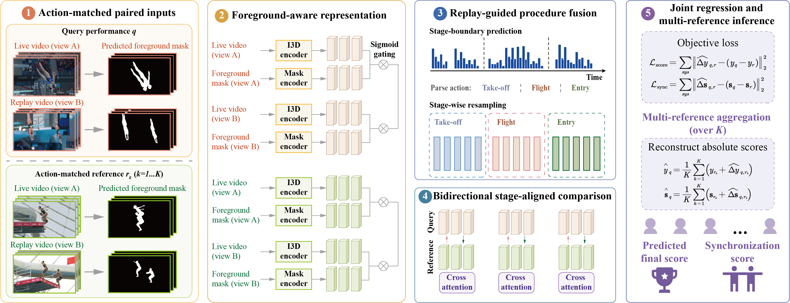
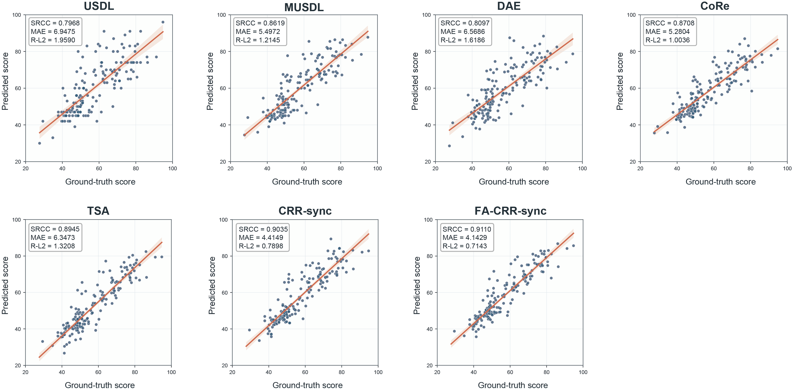

# FA-CRR-Sync

A PyTorch implementation of **Seeing Synchronization across Views: Replay-Guided Relative Action Quality Assessment of Synchronized Diving** (FA-CRR-Sync) for synchronized-diving action quality assessment.

<p align="center">
  
</p>

<p align="center">
  
</p>

## Dataset

You can download the dataset from the [Google Drive](https://drive.google.com/file/d/1vUpTW8-58vV8urqc7hP7qOnbO7qKzQ0i/view?usp=sharing) link.
```text
  FineSynchro_Final_Data/
    annotations/
    rgb/live/
    rgb/replay1/
    masks/live/
    masks/replay1/
    metadata/
```

## Installation

Use Python 3.10 and install the package from the repository root:

```bash
python -m pip install -e .
```

The provided environment snapshot is available in [`env.json`](https://github.com/JXXrrrrR/FA-CRR-Sync/blob/main/env.json).

## Training

Train FA-CRR-Sync with the paper-aligned configuration:

```bash
python scripts/train_crr_sync.py \
  --config fa_crr_sync.yaml
```

## Evaluation

Training selects the checkpoint on the validation set and evaluates the selected checkpoint on the test set. Outputs are written to the run directory specified by the experiment configuration.

## Acknowledge 
- [FineDiving](https://github.com/xujinglin/FineDiving)
- [MUSDL](https://github.com/nzl-thu/MUSDL?utm_source=chatgpt.com)
- [CoRe](https://github.com/yuxumin/CoRe?utm_source=chatgpt.com)
- [DAE](https://github.com/InfoX-SEU/DAE-AQA?utm_source=chatgpt.com)
